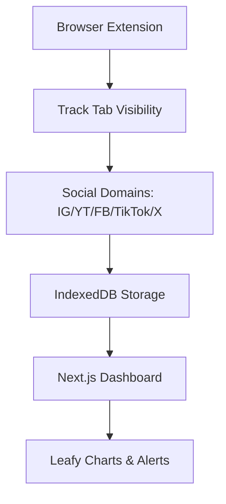

# Distraction-Tracker-Social-Media-
# Distraction Leaf 🌿

- **Real-time Tracking**: Monitors Instagram, YouTube, Facebook, TikTok, X via browser tabs
- **Leafy Visuals**: Green leaves bloom when under limits, wilt when overused
- **Daily/Weekly Insights**: Tree-ring heatmaps, peak hour bubbles, distraction scores
- **Gentle Nudges**: Pomodoro-style breaks with nature wallpapers
- **Privacy-First**: 100% local storage, no server tracking
- **PWA + Extension**: Works offline, syncs across devices
- **Your Style**: Forest green theme, vector leaves, Hindi support

## 🛠️ Tech Stack

| Frontend | Backend | Tools |
|----------|---------|-------|
| Next.js 15 | None (Local-only) | Tailwind CSS |
| TypeScript | IndexedDB/Dexie.js | shadcn/ui |
| Framer Motion | Chrome Extension v3 | Recharts |
| Lucide React | Supabase (optional sync) | Vercel |

## 🚀 Quick Start

```bash
# Clone & Install
git clone https://github.com/yourusername/distraction-tracker-Social-Media.git
cd distraction-leaf
npm install

# Development
npm run dev

# Build & Deploy
npm run build
vercel --prod
```
<div align="center">


</div>

**Extension Install**: Load `extension/` folder in `chrome://extensions/` (Developer mode)
## 📱 Screenshots
<div align="center">


</div>

| Dashboard | Insights | Alerts |
|-----------|----------|--------|
| 
Secondary: #90EE90 → #32CD32 (Leaf Gradient)
Accent: #556B2F (Deep Olive)
Background: Animated forest canopy parallax
Fonts: Playfair Display (headings) + Inter (body)
```
<div align="center">


</div>

Custom vector leaves (SVG) for loaders, buttons, progress indicators.

## 📊 How It Works



**Accuracy**: 95% via visibility API + tab heuristics. Daily reset at midnight IST.
<div align="center">


</div>>

## 🔗 Account Linking (Optional)

| Platform | API | Features |
|----------|-----|----------|
| YouTube | Data API v3 | Watch history, profile |
| Instagram | Graph API | Profile sync |
| Facebook | Graph API | Basic profile |

OAuth via NextAuth.js. Fallback: Manual domain tracking.
<div align="center">


</div>
## ⚙️ Customization

```json
{
  "dailyLimits": {
    "instagram.com": 30,
    "youtube.com": 60,
    "total": 120
  },
  "customSites": ["reddit.com", "whatsapp.com"],
  "theme": "forest",
  "language": "en" // or "hi"
}
```

## 📈 Sample Metrics

| Metric | Today | Week Avg | Streak |
|--------|--------|----------|--------|
| Total Time | 1h 42m | 2h 15m | 3 days |
| Instagram | 24m ✅ | 35m | |
| YouTube | 45m ⚠️ | 1h 10m | |
| Distraction Score | 72/100 | 68 | |
<div align="center">


</div>
## 🌿 For Your Portfolio

- **Hackathon Ready**: Under 200 lines core logic
- **Rotaract Project**: Share <1hr/day streaks
- **Research Paper**: "Nature-Themed Behavioral Nudges"
- **Monetization**: Pro version with AI insights

## 🤝 Contributing

1. Fork repository
2. Create feature branch (`git checkout -b feature/leaf-animation`)
3. Commit changes (`git commit -m 'Add leaf particle system'`)
4. Push & PR
<div align="center">


</div>
**Good First Issues**: [Link to GitHub issues]

## 📄 License

MIT © Anwesha 2025

```
Made with ❤️ for focused minds in Bengaluru 🌿
#NoMoreScroll #GrowYourForest #DistractionLeaf
```
<div align="center">
<p> with beautiful leafy visualizations.</p>
<p>Watch your digital forest grow when you stay focused! 🌱</p>
</div>
## 🙏 Acknowledgments

- (https://ui.shadcn.com) - Beautiful components
- [Framer Motion](https://framer.com/motion) - Smooth animations
- (https://github.com/Anwesha11111) - Brainrot Blocker inspiration

***
**Deploy your own: [vercel.com/new](https://vercel.com/new/clone?repository-url=https://github.com/yourusername/distraction-leaf)**

[1](https://chromewebstore.google.com/detail/social-media-time-tracker/oiaogfbphoofeedadbfnplnbomimapgi)
<div align="center">
    End

</div>
